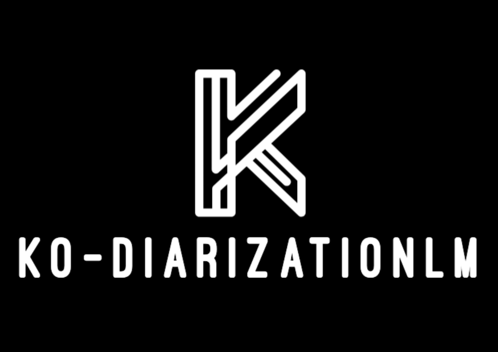
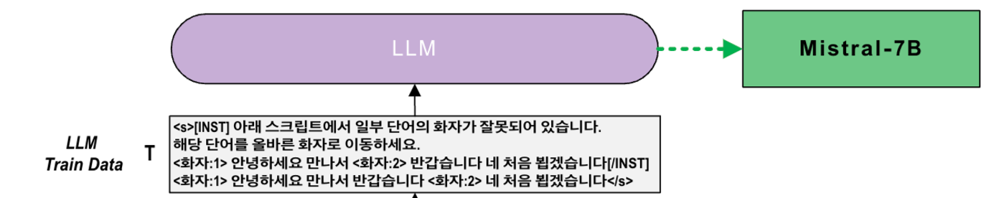
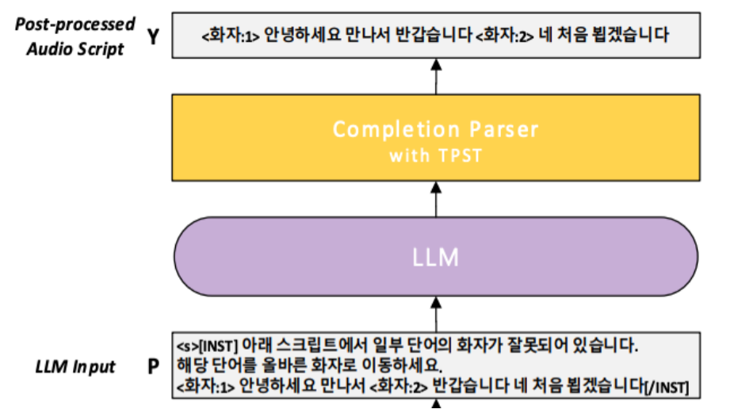
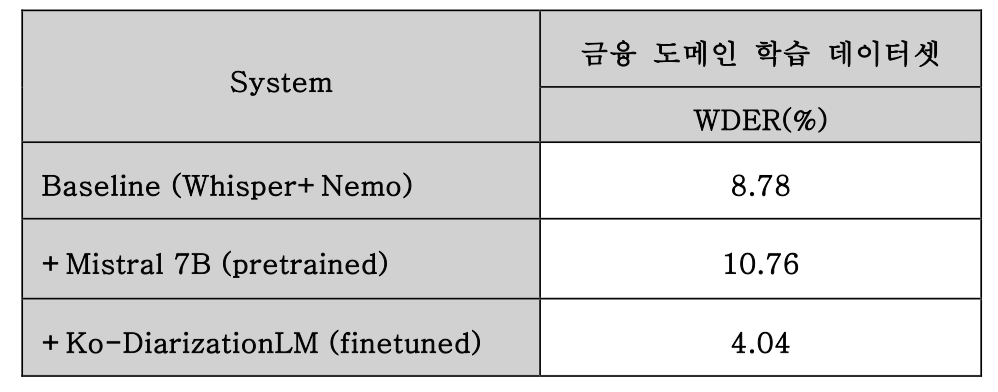

# Ko-DiarizationLM: 대형 언어 모델 기반 한국어 음성 화자분리 후처리
이 저장소는 "[Ko-DiarizationLM: 대형 언어 모델 기반 한국어 음성 화자분리 후처리] 논문" 에 사용된 언어 모델의 훈련 및 추론 코드와 데이터셋 예시를 공개합니다.

## Training
<b>실험 재현 및 발전을 쉽게 할 수 있도록 훈련 코드를 `.ipnb` 파일로 공개합니다.(`ko-diarizationlm_training.ipynb`)</b>  

 
언어 모델 훈련의 세부 사항은 아래와 같습니다.
* 파라미터 효율적 미세 조정방법인 QLoRA를 이용해  LLM 의 선형 층 파라미터만을 미세조정
  * 전체 모델의7B 파라미터 중 약 0.58%
* LLM의 입력 크기는 1024 토큰으로 제한
  * 학습 데이터 길이가 최대 입력을 초과하는 경우 발화 단위로 분할하여 사용 

* RTX 4090 1 대로 실험 진행
* 배치 사이즈는 8 으로 설정
* 학습률은 2e-4, 최대 epoch 수는 1 로 설정
* Warmup 및 선형 스케쥴링 방법을 사용
  * 전체 학습 단계 중 30% 지점까지 학습률을 증가시키고, 이후에는 점차 감소하도록 설계

## Inference
<b>실험 재현 및 발전을 쉽게 할 수 있도록 훈련 코드를 `.ipnb` 파일로 공개합니다.(`ko-diarizationlm_inference.ipynb`)</b>  

## Evaluation Results
  

* LLM 미세 튜닝에 기반한 제안 방법은 베이스라인 시스템의 WDER 을 4.74% 감소시킴을 보인다.  
* 사전학습 LLM 은 베이스라인 시스템의 오류율을 오히려 증가시켰으며, 이는 화자 분리 후처리에 있어 LLM 미세조정의 필요성을 시사한다.

